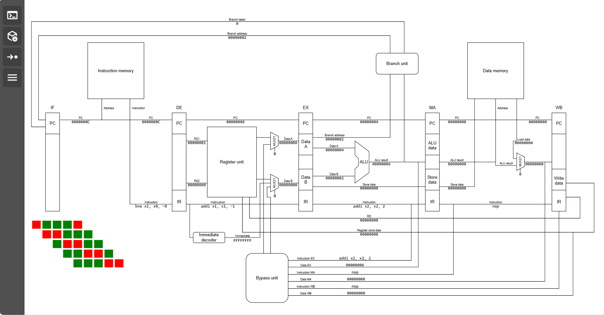

# RISC-V-Interpreter

A simple RISC-V 32I 5 stage pipeline simulator.



Program used in the image above:

```(asm)
addi x1, x0, 10
loop:
addi x2, x2, 2
addi x1, x1, -1
bne x1, x0, loop
```

Capabilities:

- Writing assembly code
  + Pseudo instruction are not supported
- Executing the code step by step
- Displaying signal values within the pipeline
- Displaying register values
- Displaying pipeline utilization

The simulator does not completely follow the RV32I specification (immediate sizes, ...) and is mainly intended to demonstrate the inner workings of the pipeline. 

Usage:

You can test the simulator by running `python -m http.server` within the project folder (other servers are available).

Before executing, the assembly code has to be loaded in to the simulator using the "load" button (second from above).